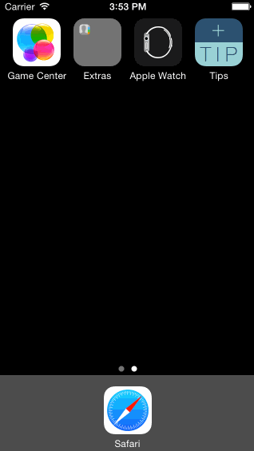

# Tips App

This is an iPhone app for calculating tip and total amount you owe on a restaurant bill.

Time spent: ~6 hours spent in total, including watching the video tutorials

Completed user stories:
* [x] Required: Follow the tip calculator [video walkthrough](https://vimeo.com/102084767) to get the basic tip calculator functionality.
* [x] Optional: Add animations to the view using alpha and translate
* [x] Optional: Change colors of the fonts of the views
* [x] Optional: Add an app icon and launch image

Notes:
I still have one bug I would like to fix in the app, however I am not sure how to check if the keyboard is currently being shown. My bug is, if the user  enters an amount, then dismisses the keyboard, then tries to adjust the tip percentage the tip view slides up. This is being called because it is going into my catch-all onEditingChanged() function, although I only want the view to animate when I am editing the text field (Thus the keyboard is up)

I spent some time figuring out how to change the status bar color to white, finally found the info.plist file to change ‘View controller-based status bar appearance’ to ‘NO’ which fixed my problem.

Walkthrough of all user stories:

GIF created with [LiceCap](http://www.cockos.com/licecap/).